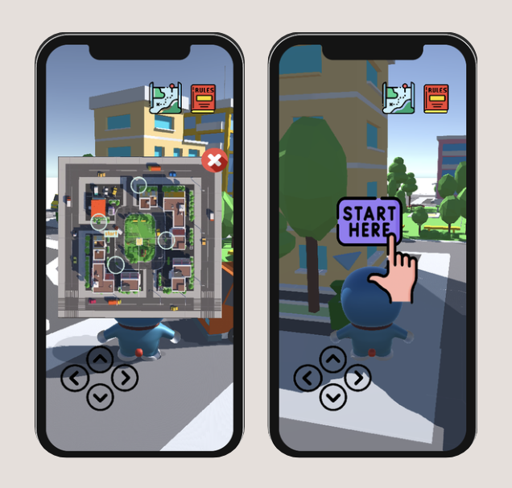
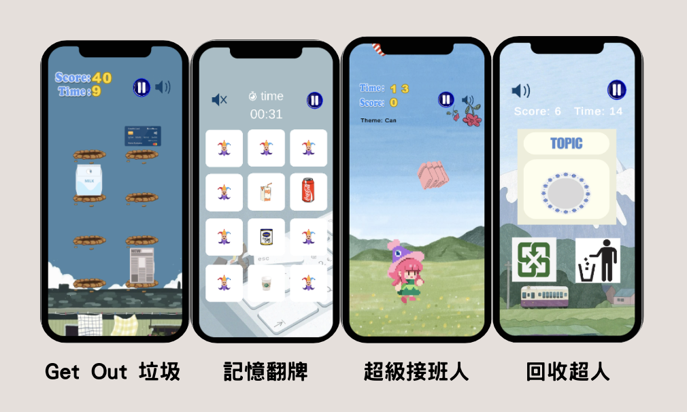
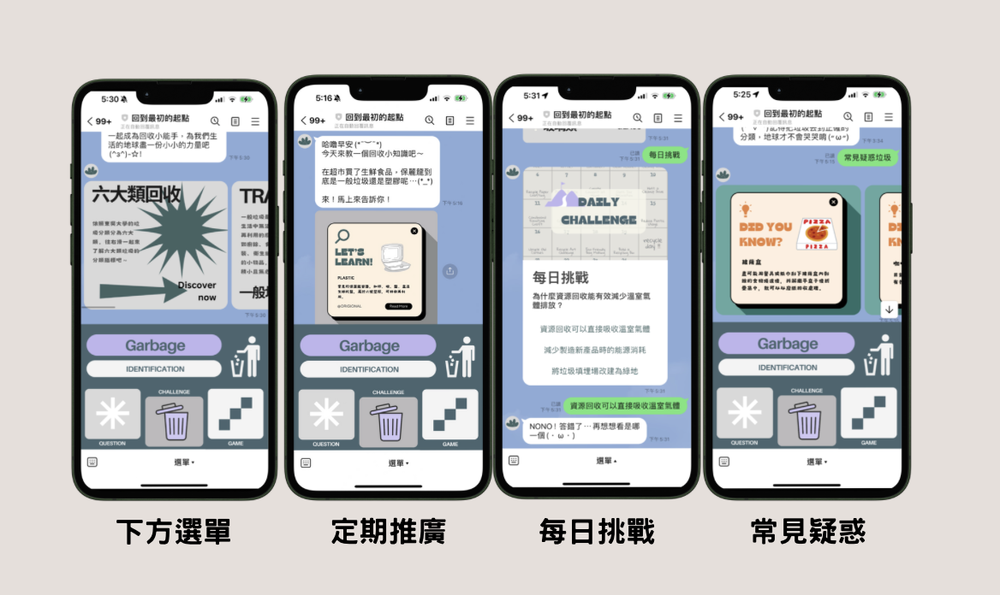
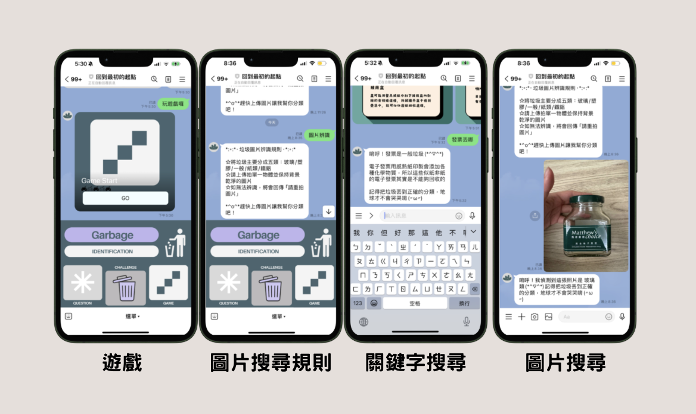

#  我的 GitHub 作品集

你好！我是張庭薰，熱愛開發和創作。目前就讀東吳大學資料科學系。

歡迎參觀我的作品！

## 🛠️ 技能
- **程式語言**：C#、Python、JavaScript
- **網頁設計**：Html、CSS、Figma
- **遊戲引擎**：Unity
- **分析工具**：RStudio、Tableau

---

## 🌟 精選作品
### 1️⃣ [資源回收地圖遊戲]
> **描述**：一款基於 Unity 的 3D與2D 互動遊戲，支援 WebGL 部署，結合回收知識達到教育理念。 
> **技術堆疊**：Unity、C#、WebGL  
> **特色功能**：
> - 即時物理模擬和碰撞偵測
> - 提供前進、後退、左轉、右轉的按鈕控制。
> - 結合回收知識達到教育理念
> 
> **預覽**：  
> 
> 
> [🌐 線上 Demo](https://yu-tung.itch.io/final-project)

---

### 2️⃣ [專案名稱](專案的 GitHub 連結)
> **描述**：另一個代表性專案的介紹，著重你的技能應用與成果。  
> **技術堆疊**：寫下所用的技術。
>
> > **預覽**：  
> 
> 

---

### 📬 聯絡我
- 📧 ztingxun54@gmail.com

---
